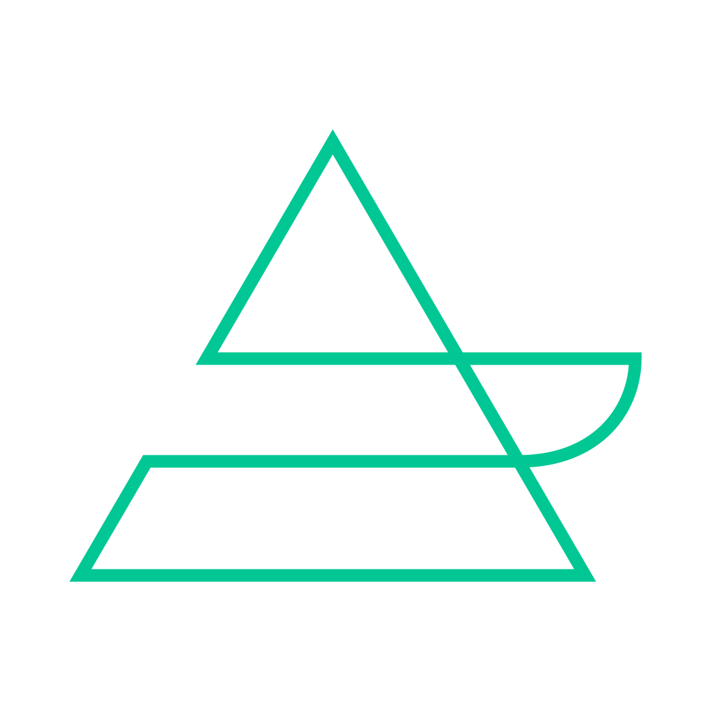

.. cano-collector documentation master file, created by
   sphinx-quickstart on Thu Jun 20 15:47:49 2024.
   You can adapt this file completely to your liking, but it should at least
   contain the root `toctree` directive.

.. meta::
   :title: Cano-Collector Documentation
   :description: Cano-collector is a Kubernetes-native alert processing and notification system.
   :author: Kubecano
   :robots: index, follow
   :og:title: Cano-Collector Documentation
   :og:description: Cano-collector is a Kubernetes-native alert processing and notification system.
   :og:type: website
   :og:site_name: Cano-Collector Docs

Welcome to cano-collector's documentation!
============================================

**Cano Collector** is an open-source alert and event ingestion agent for Kubernetes, designed to help developers and DevOps teams better understand incidents in their clusters by enriching raw alerts and events with valuable context.

Cano Collector is part of the broader **Kubecano** platform. It runs on Kubernetes clusters and connects telemetry data with notifications, enrichment pipelines, and (in future releases) AI-based analysis.

Why Cano Collector?
-------------------

Traditional alerts and crash loops often lack the full story. Cano Collector gives you:

* **Deep context** behind alerts and events
* **Flexible routing** to the right teams  
* **Rich formatting** with structured data and attachments
* **Unified view** of Kubernetes health, enriched and sent where it matters

Whether it's an ``OOMKilled`` pod or a ``CrashLoopBackOff``, Cano Collector helps you understand *why* something broke — not just that it did.

What It Does
------------

Cano Collector listens for **Kubernetes cluster signals**, including:

* 📣 **Alerts from Alertmanager**
* ⚠️ **Kubernetes Events** such as:
  * Pod restarts / CrashLoops
  * Helm release failures
  * Resource quota violations

For each alert or event, Cano Collector:

1. **Builds a structured ``Issue`` object** that includes:
   * Type: ``alert`` or ``event``
   * Source: ``prometheus``, ``k8s``, ``helm``, etc.
   * Severity: ``HIGH``, ``LOW``, ``INFO``, ``DEBUG``
   * Timestamps: created/started/resolved

2. **Enriches it with context** through ``Enrichment`` blocks:
   * **Pod logs** as ``MarkdownBlock``
   * **Resource configuration** as ``TableBlock``
   * **File attachments** as ``FileBlock``
   * **Structured data** as ``JsonBlock``

3. **Sends enriched data** to configured destinations:
   * 💬 **Slack channels** (MVP - Available Now)
   * 🧭 Kubecano SaaS (Planned)
   * 📟 PagerDuty, OpsGenie (Planned)
   * 🔀 Kafka topics (Planned)

Architecture Overview
--------------------

Cano Collector follows a clean architecture pattern with clear separation of concerns:

.. code-block:: text

    ┌─────────────────┐    ┌─────────────────┐    ┌─────────────────┐
    │   Alertmanager  │    │   Kubernetes    │    │   Other Sources │
    │   (Prometheus)  │    │     Events      │    │                 │
    └─────────┬───────┘    └─────────┬───────┘    └─────────┬───────┘
              │                      │                      │
              └──────────────────────┼──────────────────────┘
                                     │
                        ┌─────────────▼─────────────┐
                        │     Cano Collector        │
                        │  (Deployed on K8s)        │
                        └─────────────┬─────────────┘
                                      │
                        ┌─────────────▼─────────────┐
                        │      Destination          │
                        │   (Strategy Pattern)      │
                        └─────────────┬─────────────┘
                                      │
                        ┌─────────────▼─────────────┐
                        │       Sender              │
                        │   (Factory Pattern)       │
                        └─────────────┬─────────────┘
                                      │
                        ┌─────────────▼─────────────┐
                        │    External Services      │
                        │   Slack, Teams, etc.      │
                        └───────────────────────────┘

Core Components
~~~~~~~~~~~~~~~

* **``Issue``**: The central data structure containing alert/event information
* **``Enrichment``**: Additional context blocks (logs, tables, files, etc.)
* **``Destination``**: Strategy pattern implementation for different notification channels
* **``Sender``**: Factory pattern implementation for API communication

Current Status (MVP)
-------------------

✅ **Available Now**
~~~~~~~~~~~~~~~~~~~

* **Slack Integration**: Full-featured Slack destination with:
  * Rich message formatting with blocks and attachments
  * Thread support for related alerts
  * File uploads for logs and data
  * Color-coded messages based on severity
  * Table formatting for structured data

🚧 **Coming Soon**
~~~~~~~~~~~~~~~~~

* **MS Teams Integration**: Adaptive Cards support
* **PagerDuty Integration**: Incident lifecycle management
* **OpsGenie Integration**: Dynamic team routing
* **Jira Integration**: Ticket creation and management
* **DataDog Integration**: Event correlation
* **Kafka Integration**: Data streaming
* **ServiceNow Integration**: Incident management

Use Cases
---------

Current (Slack MVP)
~~~~~~~~~~~~~~~~~~~

* **OOMKilled Pod**: Get a Slack message with pod logs, resource limits, and memory usage
* **CrashLoopBackOff**: Receive container logs, restart count, and exit codes
* **Helm Release Failure**: See release details, failed hooks, and rollback status

Planned
~~~~~~~

* **Multi-channel routing**: Send different alerts to different teams
* **Incident management**: Create tickets in Jira, incidents in PagerDuty
* **Data streaming**: Send events to Kafka for downstream processing
* **AI analysis**: Automated root cause analysis and remediation suggestions

.. toctree::
   :hidden:
   :maxdepth: 2
   :caption: Getting Started

   quick_start
   installation
   first_alert

.. toctree::
   :hidden:
   :maxdepth: 2
   :caption: User Guide

   configuration/index
   troubleshooting

.. toctree::
   :hidden:
   :maxdepth: 2
   :caption: Developer Guide

   architecture/index
   development_guide
   api_reference
   implementation_tasks

.. toctree::
   :hidden:
   :maxdepth: 2
   :caption: Operations & Maintenance

   monitoring
   maintenance
